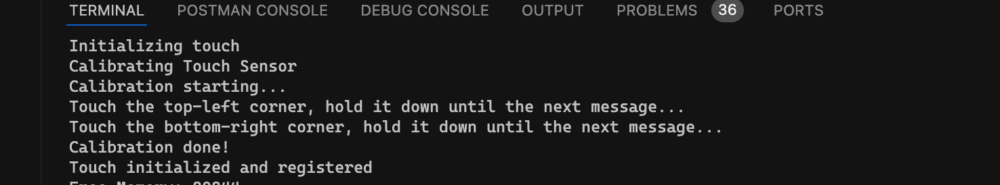
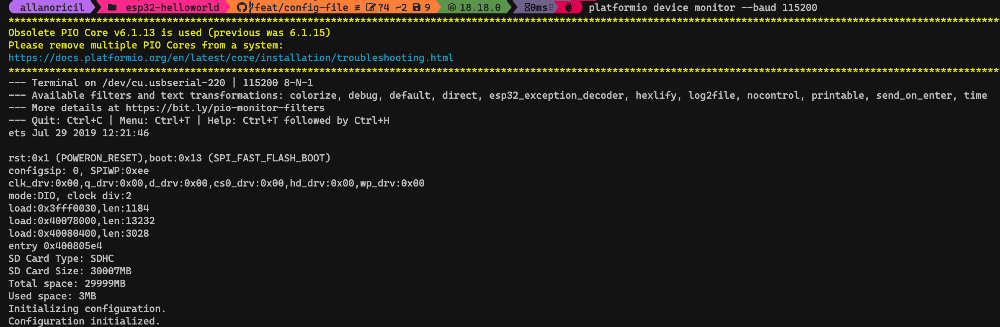
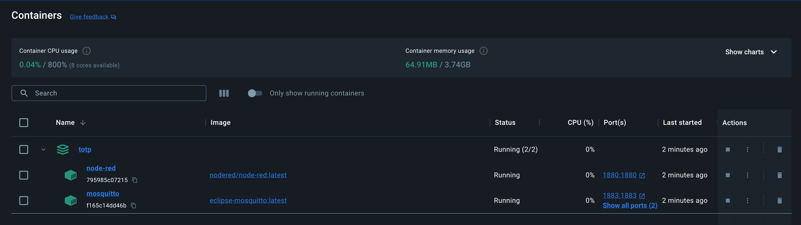
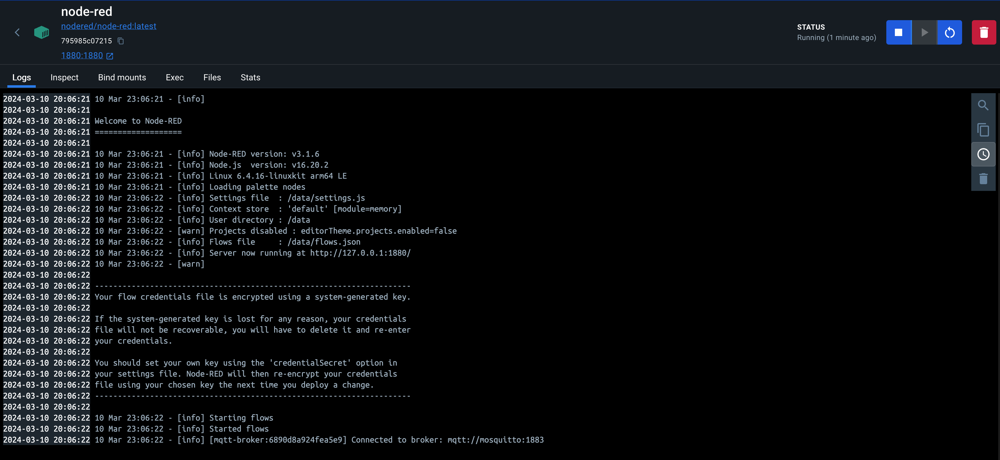
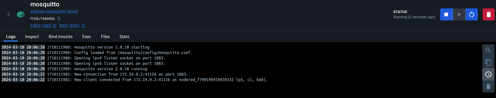

# ESP32 MFA Authenticator

![Build with PlatformIO](https://img.shields.io/badge/build%20with-PlatformIO-orange?logo=data%3Aimage%2Fsvg%2Bxml%3Bbase64%2CPHN2ZyB3aWR0aD0iMjUwMCIgaGVpZ2h0PSIyNTAwIiB2aWV3Qm94PSIwIDAgMjU2IDI1NiIgeG1sbnM9Imh0dHA6Ly93d3cudzMub3JnLzIwMDAvc3ZnIiBwcmVzZXJ2ZUFzcGVjdFJhdGlvPSJ4TWlkWU1pZCI+PHBhdGggZD0iTTEyOCAwQzkzLjgxIDAgNjEuNjY2IDEzLjMxNCAzNy40OSAzNy40OSAxMy4zMTQgNjEuNjY2IDAgOTMuODEgMCAxMjhjMCAzNC4xOSAxMy4zMTQgNjYuMzM0IDM3LjQ5IDkwLjUxQzYxLjY2NiAyNDIuNjg2IDkzLjgxIDI1NiAxMjggMjU2YzM0LjE5IDAgNjYuMzM0LTEzLjMxNCA5MC41MS0zNy40OUMyNDIuNjg2IDE5NC4zMzQgMjU2IDE2Mi4xOSAyNTYgMTI4YzAtMzQuMTktMTMuMzE0LTY2LjMzNC0zNy40OS05MC41MUMxOTQuMzM0IDEzLjMxNCAxNjIuMTkgMCAxMjggMCIgZmlsbD0iI0ZGN0YwMCIvPjxwYXRoIGQ9Ik0yNDkuMzg2IDEyOGMwIDY3LjA0LTU0LjM0NyAxMjEuMzg2LTEyMS4zODYgMTIxLjM4NkM2MC45NiAyNDkuMzg2IDYuNjEzIDE5NS4wNCA2LjYxMyAxMjggNi42MTMgNjAuOTYgNjAuOTYgNi42MTQgMTI4IDYuNjE0YzY3LjA0IDAgMTIxLjM4NiA1NC4zNDYgMTIxLjM4NiAxMjEuMzg2IiBmaWxsPSIjRkZGIi8+PHBhdGggZD0iTTE2MC44NjkgNzQuMDYybDUuMTQ1LTE4LjUzN2M1LjI2NC0uNDcgOS4zOTItNC44ODYgOS4zOTItMTAuMjczIDAtNS43LTQuNjItMTAuMzItMTAuMzItMTAuMzJzLTEwLjMyIDQuNjItMTAuMzIgMTAuMzJjMCAzLjc1NSAyLjAxMyA3LjAzIDUuMDEgOC44MzdsLTUuMDUgMTguMTk1Yy0xNC40MzctMy42Ny0yNi42MjUtMy4zOS0yNi42MjUtMy4zOWwtMi4yNTggMS4wMXYxNDAuODcybDIuMjU4Ljc1M2MxMy42MTQgMCA3My4xNzctNDEuMTMzIDczLjMyMy04NS4yNyAwLTMxLjYyNC0yMS4wMjMtNDUuODI1LTQwLjU1NS01Mi4xOTd6TTE0Ni41MyAxNjQuOGMtMTEuNjE3LTE4LjU1Ny02LjcwNi02MS43NTEgMjMuNjQzLTY3LjkyNSA4LjMyLTEuMzMzIDE4LjUwOSA0LjEzNCAyMS41MSAxNi4yNzkgNy41ODIgMjUuNzY2LTM3LjAxNSA2MS44NDUtNDUuMTUzIDUxLjY0NnptMTguMjE2LTM5Ljc1MmE5LjM5OSA5LjM5OSAwIDAgMC05LjM5OSA5LjM5OSA5LjM5OSA5LjM5OSAwIDAgMCA5LjQgOS4zOTkgOS4zOTkgOS4zOTkgMCAwIDAgOS4zOTgtOS40IDkuMzk5IDkuMzk5IDAgMCAwLTkuMzk5LTkuMzk4em0yLjgxIDguNjcyYTIuMzc0IDIuMzc0IDAgMSAxIDAtNC43NDkgMi4zNzQgMi4zNzQgMCAwIDEgMCA0Ljc0OXoiIGZpbGw9IiNFNTcyMDAiLz48cGF0aCBkPSJNMTAxLjM3MSA3Mi43MDlsLTUuMDIzLTE4LjkwMWMyLjg3NC0xLjgzMiA0Ljc4Ni01LjA0IDQuNzg2LTguNzAxIDAtNS43LTQuNjItMTAuMzItMTAuMzItMTAuMzItNS42OTkgMC0xMC4zMTkgNC42Mi0xMC4zMTkgMTAuMzIgMCA1LjY4MiA0LjU5MiAxMC4yODkgMTAuMjY3IDEwLjMxN0w5NS44IDc0LjM3OGMtMTkuNjA5IDYuNTEtNDAuODg1IDIwLjc0Mi00MC44ODUgNTEuODguNDM2IDQ1LjAxIDU5LjU3MiA4NS4yNjcgNzMuMTg2IDg1LjI2N1Y2OC44OTJzLTEyLjI1Mi0uMDYyLTI2LjcyOSAzLjgxN3ptMTAuMzk1IDkyLjA5Yy04LjEzOCAxMC4yLTUyLjczNS0yNS44OC00NS4xNTQtNTEuNjQ1IDMuMDAyLTEyLjE0NSAxMy4xOS0xNy42MTIgMjEuNTExLTE2LjI4IDMwLjM1IDYuMTc1IDM1LjI2IDQ5LjM2OSAyMy42NDMgNjcuOTI2em0tMTguODItMzkuNDZhOS4zOTkgOS4zOTkgMCAwIDAtOS4zOTkgOS4zOTggOS4zOTkgOS4zOTkgMCAwIDAgOS40IDkuNCA5LjM5OSA5LjM5OSAwIDAgMCA5LjM5OC05LjQgOS4zOTkgOS4zOTkgMCAwIDAtOS4zOTktOS4zOTl6bS0yLjgxIDguNjcxYTIuMzc0IDIuMzc0IDAgMSAxIDAtNC43NDggMi4zNzQgMi4zNzQgMCAwIDEgMCA0Ljc0OHoiIGZpbGw9IiNGRjdGMDAiLz48L3N2Zz4=) [](code_of_conduct.md) [](https://github.com/AllanOricil/esp32-mfa-totp-generator/actions/workflows/ci.yaml)

<a href="https://www.buymeacoffee.com/allanoricil" target="_blank"></a>


This is a personal project that creates MFA TOTP codes. I created it to help me to get TOTPs without interacting with my phone. Before creating it, every time I needed a new TOTP, I had to:

- find my phone
- if it is not charged, charge it, and then wait a few minutes until it is fully operational
- if it is charged, unlock it
- find a Virtual MFA App
- unlock it
- find the TOTP for the service I need, which sometimes requires a lot of vertical scrolling.

Other motives:

- when using my personal phone to get mfa totp codes, I get distracted by notifications and a lot of other things.
- not safe to store secrets on a device that you use when going out. If the device is lost, and there is no security layer to protect unintended access to the virtual MFA App, there is a high chance someone can impersonate your identity.
- secrets are decoupled from the device, and this allows me to easily switch to another one when necessary. I just need to insert the SD card containing my services onto another device flashed with the same code.
- not all services that I use support fido keys or passkeys.
- I wanted to learn how MFA works.
- I wanted to learn how ESP32 works.

## 🎬 Demos

<https://github.com/AllanOricil/esp32-mfa-totp-generator/assets/55927613/166f6ea7-1046-4117-ae22-67991c8e6d8c>

<https://github.com/AllanOricil/esp32-mfa-totp-generator/assets/55927613/6e240518-a35b-4bf0-8a41-ece0dad9efb9>

<https://github.com/AllanOricil/esp32-mfa-totp-generator/assets/55927613/a398b55b-a415-4d21-8f28-91df153bac9f>

<https://github.com/AllanOricil/esp32-mfa-totp-generator/assets/55927613/b610d1de-1bf9-47fe-9148-8973cb30205d>

## 🌐 Installation Site

You can flash your ESP32-CYD board with this code using this [site](https://allanoricil.github.io/esp32-mfa-authenticator)

> [!NOTE]
> This site was based on https://esphome.github.io/esp-web-tools/

## ⚙️ Parts

- `ESP32-2432S028`
- 3D printed black case
- Acrillic case

> [!TIP]
> You can buy this board from Aliexpress clicking on any of these affiliate links: [USD](https://s.click.aliexpress.com/e/_mNCBRAA) [BRL](https://s.click.aliexpress.com/e/_mOtZaxM)

> [!TIP]
> You can buy this acrillic case from Aliexpress clicking on any of these affiliate links: [USD](https://s.click.aliexpress.com/e/_mLYVthc) [BRL](https://s.click.aliexpress.com/e/_m0Tt9wq)

> [!TIP]
> The 3D model for the black case was taking from this [link](https://makerworld.com/en/models/137424#profileId-149549)

## 💵 Total Project Cost

| Part                  | Cost     |
| --------------------- | -------- |
| ESP32-2432S028        | 9.25 USD |
| 3D printed black case | 12.7 USD |
| Acrillic case         | 2.5 USD  |

> [!NOTE]
> Prices do not consider expenses with taxes and shipping.

> [!NOTE]
> Prices were taking in February 2024.

## 💻 Dev Environment Requirements

| dependency                       | version   |
| -------------------------------- | --------- |
| python                           | >= v3.9   |
| node                             | >= v18.18 |
| npm                              | >= v10.2  |
| vscode                           | >= v1.87  |
| platform.io ide vscode extension | >= v3.3   |
| docker                           | >= v25.0  |

> [!WARNING]
> Don't forget to install a [driver to allow your OS to recognize esp32](https://www.silabs.com/developers/usb-to-uart-bridge-vcp-drivers)

> [!IMPORTANT]
> Node and npm, its package manager, are required because several development tools are used in this project. Among these tools are those that enforce the "conventional commits" standard. This standard is a lightweight convention on top of commit messages, offering an easy set of rules for creating an explicit commit history.

> [!TIP]
> If platform.io extension does not recognize your board after clicking on `Upload`, `Upload and Monitor` or `Monitor` buttons, it means the driver was not properly setup. In MacOS, after installing the driver from Sillicon Labs, I had to restart the system before mac could identify the board.

## 🔌 Boot and Reset Requirements

- 2.4Ghz WiFi signal with internet connection, in order to sync the board's clock with the [NTP server](https://ntp.org/).
- SD card with `config.yml` in the root as shown below:

### ⚙️ config.yml

```yml
# [REQUIRED] necessary for enabling future changes
version: 0.0.0

wifi:
  # [REQUIRED] (text) wifi connection password
  password: test
  # [REQUIRED] (text) wifi id
  ssid: test

mqtt:
  # [OPTIONAL] (text) mqtt server port
  port: 1883
  # [OPTIONAL] (text) mqtt server ip
  server: 192.168.0.1
  # [OPTIONAL] (text) mqtt connection username
  username: test
  # [OPTIONAL] (text) mqtt connection password
  password: test

security:
  # [OPTIONAL] (number) [default 3] board is locked and requires a hard reset, after N number of wrong unlock attempts
  max_number_of_wrong_unlock_attempts: 3
  pin:
    # [OPTIONAL] (text) pin code composed of numbers only and HMAC-SHA256 hashed
    hash: test
    # [OPTIONAL] (text) key used to hash pin code
    key: test

display:
  # [OPTIONAL] (number) [default 10] if provided, the display will turn off after n seconds have passed
  sleep_timeout: 10

touch:
  # [OPTIONAL] (bool=false|0) calibrate touch sensor if true or 1
  force_calibration: 0
```

> [!TIP]
> Once the boot process is finished, remove the SD card from the board, and store it somewhere safe. Before rebooting, or if you want to add new secrets, remember to put it back in the board.

> [!WARNING]
> Upon the initial boot, it is imperative to undergo the calibration process at least once, as outlined in the `How to build` section below.

## 📖 Guides

### 📚 How to build

#### 📚 Using Platform IO IDE in VS Code

1. Install Platform IO IDE extension in VS Code.
2. Open this project in a new vscode workspace, and wait for Platform.IO to finish its automatic setup.
3. Open `platformio.ini` and edit
4. Connect your board to your computer. If you installed the right drivers, the next steps should work just fine.
5. Click on the Platform.IO button, in VS Code's sidebar.
6. Then click on `esp32-cyd -> General -> Build` and wait until the build is finished with success.
7. Orient the board horizontally, placing the USB port(s) on the right side and positioning the screen towards you. This step is important for when calibrating the touch sensor.
8. Finally, click on `esp32-cyd -> General -> Upload ad Monitor` to flash the code into your board, and verify its outputs using a terminal.

#### 📚 Using Platform IO CLI

Alternatively, if you prefer using CLIs, install PlatformIO's official CLI using this [tutorial](https://platformio.org/install/cli), and then follow the next steps:

1. Run `platformio device list` and annotate the device path of your board.

> [!TIP]
> You can discover which path belongs to your board by comparing the outputs of this command when your board is connected and not.

2. Run `platformio run --environment esp32-cyd` to build the application
3. Orient the board horizontally, placing the USB port(s) on the right side and positioning the screen towards you. This step is important for when calibrating the touch sensor.
4. Upload the code to your board using `platformio run --target upload --upload-port ${DEVICE_PATH} --target monitor --environment esp32-cyd`.
5. Wait until the screen turns white, then proceed to follow the calibration instructions displayed in your terminal for the touch sensor.
   

> [!NOTE]
> The calibration process occurs only once, immediately after flashing the board and during its initial boot.

> [!WARNING]
> The pin screen won't work if you did not calibrate the touch sensor using the orientation described above in step 3.

> [!IMPORTANT]
> Remember to substitue `${DEVICE_PATH}` with the value you got in step 1.

### 📚 How to add TOTP Secrets

The secrets used to compute TOTP codes must be stored in a file called `keys.txt`, and be placed in the root of an SD card. It must follow the format shown below:

```bash
service_id,encoded_base_32_secret
```

Each service must be added on a new line. For example:

```bash
aws-1,DSAJDHHAHASAUDOASNOTREALOADAKLDASAJFPOAIDONTEVENTRYOASFAIPO
aws-2,DSAJDHHAHASAUDOASNOTREALOADAKLDASAJFPOAIDONTEVENTRYOASFAIPO
aws-3,DSAJDHHAHASAUDOASNOTREALOADAKLDASAJFPOAIDONTEVENTRYOASFAIPO

```

> [!WARNING]
> This file must end with a new line.

> [!WARNING]
> Secrets must be unencrypted and based 32 encoded. In the future, my plan is to decrypt secrets using a secret stored in the board. With this approach, a stolen SD card won't work on a different board flashed with the same code unless the board has the same key.

### 📚 How to verify if TOTP codes are correct

1. Go to <https://totp.danhersam.com/>
2. Paste/type your encoded base 32 secret in the secret field, and then compare the TOTP code shown with the one you are seeing on the ESP32's screen.

### 📚 How to recalibrate the touch sensor

1. Add the following property to the root of your `config.yml` and save it.

```yml
touch:
  force_calibration: true
```

> [!NOTE]
> The calibration process will initiate upon the initial boot of the board, regardless of the content stored in `config.yml`.

2. Connect the board to your computer.
3. Open a terminal, and run `platformio device monitor --baud 115200` to monitor the board's serial port.
   
4. Orient the board horizontally, placing the USB port(s) on the right side and positioning the screen towards you.
5. Ensure the SD card containing `config.yml` is on the board.
6. Press the `RST` button on the board and wait until the screen becomes pure white, and follow the instructions as shown below.
   
7. Remove the touch properties from `config.yml`, save it and put it back on the board.
8. Press the `RST` button once more, and now verify that the calibration flow isn't triggered anymore.

> [!WARNING]
> The pin screen won't work if you did not calibrate the touch sensor using the orientation described above in step 4.

### 📚 How to register TOTP Secrets without inserting the SD card into a computer

To enable saving secrets to ESP32 via a local network, this project uses [MQTT](https://mqtt.org/) as the messaging protocol, [Node-red](https://nodered.org/) as the postman (per say) and [Eclipse Mosquito](https://mosquitto.org/) as the MQTT broker. Both services can be started using docker compose using a docker-compose.yaml file located in the root of this project, in order to ease the setup. So, before continuing, install Docker on your computer following the guide found [here](https://www.docker.com/get-started/).

After that, run the following script to start both node-red and the mqtt broker:

```bash
./scripts/start-node-red.sh
```

Open node-red at `http://localhost:1880`, and then load the flow from `./node-red/insert-secret.json`. For now you must manually setup the node input with the secret you want to send to your ESP32, but in the future I plan to have a small app and a chrome extension as clients using the local node-red services to ease the process of storing secrets on the board.

> [!IMPORTANT]
> Make sure to have the following ports free before running `./scripts/start-node-red.sh`: 1880 (node-red), 1883 (eclipse/mosquitto), 9001 (eclipse/mosquito).

You should see the following containers in the docker app.







> [!IMPORTANT]
> Remember to assign static IPs to the host running the MQTT service, as weel as for the esp32, in your router. This is a suggestion to avoid having to update the `MQTT_SERVER` constant with a new ip every time your router decides to change the ip of your host.

> [!TIP]
> If your host can't receive messages from other devices on the same network, it could be a firewall problem. Configure the firewall in the host to enable it to receive requests from other devices on your local network.

After all services have initialized, open node-red at `localhost:1880`, and import `./node-red/insert-secret.json` flow. Use this [tutorial](https://nodered.org/docs/user-guide/editor/workspace/import-export) to guide you to import flows into node-red.

> [!IMPORTANT]
> Remember to put the SD card again in the board, if you want the secret to be stored. If you don't do it, after a reset the TOTP code for that secret won't appear because the secret wasn't written to disk.

## 🎯 Roadmap

### ✅ Display multiple TOTP codes

People often use multiple services that require MFA TOTP codes with high frequency because of their short living sessions.

### ✅ Unlock with PIN Code

It is not secure to have unencrypted secrets stored without protection

### ✅ Add secrets via a local network, using a secure channel

Ease the process of adding new services. With this feature I won't need to insert the SD card on my computer. If there is no SD card on the board, the channel to register new services is going to be closed. I also plan to require fingerprint/pin/password before opening this channel.

### ✅ Manage board settings using a browser

Users can manage their board settings using a browser. Once the board is connected to the local network, open a browser and type `{IP_ADDRESS}/esp32/settings`.

> [!WARNING]
> At the moment, secrets must be re-entered before submiting the form. If you don't re-type the secrets, they will be stored as `*******` in the SD card, and this will break the boot.

### ✅ Display turns off automatically after N seconds without user interaction

After booting, the display turns off automatically if it doesn't receive touch events after N seconds. N is a configurable in the `config.yml`.

### 🔜 Create chrome extension to ease registering TOTP secrets

When the ESP32-MFA-Authenticator extension is enabled, a new button called "register secret" appears, in the browser's context menu, when right clicking over a QR code. When selecting this button, the registration flow starts.

```
1. User select "register secret" to start the registration flow.
2. The ESP32-MFA-Authenticator extension receives it, and forwards the message, using an HTTPS, to the ESP32-MFA-Authenticator service, built with keycloak.
3. The ESP32-MFA-Authenticator service verifies if the User is authenticated. If the request doesn't have the User's credentials, the Authentication flow starts.
4. After finishing the authentication flow, the registration flow begin.
5. The first step is to connect to the right MQTT topic using username and password. These credentials are stored securely in the server. If a successful connection is opened, the registration flow continues.
6. The ESP32-MFA-Authenticator service creates the message that contains the secret name and its value, then signs it with a strong key, and finally posts the message to the MQTT topic the esp32 board can read.
7. The esp32 then validates if the message came from the ESP32-MFA-Authenticator service. If the message is valid, the flow continues.
8. The esp32 then reads the secret and stores it in the SD Card, if one is present.
9. The esp32 then notifies the ESP32-MFA-Authenticator service if everything went well or not.
10.The ESP32-MFA-Authenticator service notifies the ESP32-MFA-Authenticator extension about the result.
```

> **INFO:** the above steps are summarizing my initial plan.

### 🔜 Group TOTP Codes

I work with a customer that has multiple AWS accounts, and each has its own MFA Virtual device. To help me to easily find the MFA TOTP codes for a group of accounts that belongs to the same customer, I decided to create a way to group TOTP codes together on its own separate view. Each group of TOTP secrets will result in a page on the TOTP Screen. The User can select the page by swiping to the right or left. With this feature, Users will be able to manage multiple virtual MFA devices for multiple customers using the same device. To further secure TOTPs for a group, the User will be able to set a PIN code for a group. If PIN code is set for that group, a PIN Screen appears before the group of TOTPs can be rendered. There will also still exist the Global PIN code, which protects all TOTPs.

### 🔜 Block access after few wrong unlock attempts

Improve the validation function to block access to the board after few wrong attempts happened. With this enhancement, brute forcing all possible combinations won't be possible.

### 🔜 Unlock with fingerprint

Instead of typing a pin code, it will be possible to unlock the board using a fingerprint. The goal is to ease the access to the TOTP codes, while maintaining them secure. It will also work globally or by group.

### 🔜 Custom Styles

Users will be able to create custom styles for the UI standard components
