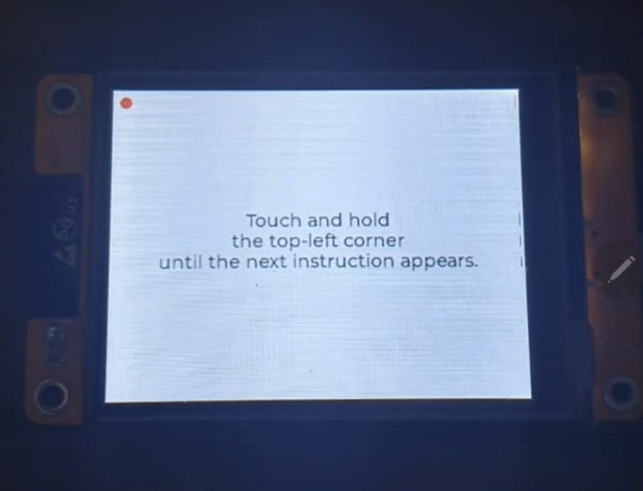

> [!IMPORTANT]
> - discontinued because this is not going to help me get a reputable title
> - I receieved several negative comments from developers from the following Reddit communities `r/programming`, `r/softwareEngineering`, `/r/software`, `/esp32`. In summary, most developers prefer, in their words, "convenience" over security. Installing MFA apps from Google/Microsoft in their smartphones, and mix personal and professional services secrets is not a problem, is easier, cheaper, and "one less device" to be concerned. Some of them prefer using password managers to manage both passwords and the secret that creates TOTPs. Additionally, developers that earn strong currencies prefer buying an overpriced yubikey.

![Build with PlatformIO](https://img.shields.io/badge/build%20with-PlatformIO-orange?logo=data%3Aimage%2Fsvg%2Bxml%3Bbase64%2CPHN2ZyB3aWR0aD0iMjUwMCIgaGVpZ2h0PSIyNTAwIiB2aWV3Qm94PSIwIDAgMjU2IDI1NiIgeG1sbnM9Imh0dHA6Ly93d3cudzMub3JnLzIwMDAvc3ZnIiBwcmVzZXJ2ZUFzcGVjdFJhdGlvPSJ4TWlkWU1pZCI+PHBhdGggZD0iTTEyOCAwQzkzLjgxIDAgNjEuNjY2IDEzLjMxNCAzNy40OSAzNy40OSAxMy4zMTQgNjEuNjY2IDAgOTMuODEgMCAxMjhjMCAzNC4xOSAxMy4zMTQgNjYuMzM0IDM3LjQ5IDkwLjUxQzYxLjY2NiAyNDIuNjg2IDkzLjgxIDI1NiAxMjggMjU2YzM0LjE5IDAgNjYuMzM0LTEzLjMxNCA5MC41MS0zNy40OUMyNDIuNjg2IDE5NC4zMzQgMjU2IDE2Mi4xOSAyNTYgMTI4YzAtMzQuMTktMTMuMzE0LTY2LjMzNC0zNy40OS05MC41MUMxOTQuMzM0IDEzLjMxNCAxNjIuMTkgMCAxMjggMCIgZmlsbD0iI0ZGN0YwMCIvPjxwYXRoIGQ9Ik0yNDkuMzg2IDEyOGMwIDY3LjA0LTU0LjM0NyAxMjEuMzg2LTEyMS4zODYgMTIxLjM4NkM2MC45NiAyNDkuMzg2IDYuNjEzIDE5NS4wNCA2LjYxMyAxMjggNi42MTMgNjAuOTYgNjAuOTYgNi42MTQgMTI4IDYuNjE0YzY3LjA0IDAgMTIxLjM4NiA1NC4zNDYgMTIxLjM4NiAxMjEuMzg2IiBmaWxsPSIjRkZGIi8+PHBhdGggZD0iTTE2MC44NjkgNzQuMDYybDUuMTQ1LTE4LjUzN2M1LjI2NC0uNDcgOS4zOTItNC44ODYgOS4zOTItMTAuMjczIDAtNS43LTQuNjItMTAuMzItMTAuMzItMTAuMzJzLTEwLjMyIDQuNjItMTAuMzIgMTAuMzJjMCAzLjc1NSAyLjAxMyA3LjAzIDUuMDEgOC44MzdsLTUuMDUgMTguMTk1Yy0xNC40MzctMy42Ny0yNi42MjUtMy4zOS0yNi42MjUtMy4zOWwtMi4yNTggMS4wMXYxNDAuODcybDIuMjU4Ljc1M2MxMy42MTQgMCA3My4xNzctNDEuMTMzIDczLjMyMy04NS4yNyAwLTMxLjYyNC0yMS4wMjMtNDUuODI1LTQwLjU1NS01Mi4xOTd6TTE0Ni41MyAxNjQuOGMtMTEuNjE3LTE4LjU1Ny02LjcwNi02MS43NTEgMjMuNjQzLTY3LjkyNSA4LjMyLTEuMzMzIDE4LjUwOSA0LjEzNCAyMS41MSAxNi4yNzkgNy41ODIgMjUuNzY2LTM3LjAxNSA2MS44NDUtNDUuMTUzIDUxLjY0NnptMTguMjE2LTM5Ljc1MmE5LjM5OSA5LjM5OSAwIDAgMC05LjM5OSA5LjM5OSA5LjM5OSA5LjM5OSAwIDAgMCA5LjQgOS4zOTkgOS4zOTkgOS4zOTkgMCAwIDAgOS4zOTgtOS40IDkuMzk5IDkuMzk5IDAgMCAwLTkuMzk5LTkuMzk4em0yLjgxIDguNjcyYTIuMzc0IDIuMzc0IDAgMSAxIDAtNC43NDkgMi4zNzQgMi4zNzQgMCAwIDEgMCA0Ljc0OXoiIGZpbGw9IiNFNTcyMDAiLz48cGF0aCBkPSJNMTAxLjM3MSA3Mi43MDlsLTUuMDIzLTE4LjkwMWMyLjg3NC0xLjgzMiA0Ljc4Ni01LjA0IDQuNzg2LTguNzAxIDAtNS43LTQuNjItMTAuMzItMTAuMzItMTAuMzItNS42OTkgMC0xMC4zMTkgNC42Mi0xMC4zMTkgMTAuMzIgMCA1LjY4MiA0LjU5MiAxMC4yODkgMTAuMjY3IDEwLjMxN0w5NS44IDc0LjM3OGMtMTkuNjA5IDYuNTEtNDAuODg1IDIwLjc0Mi00MC44ODUgNTEuODguNDM2IDQ1LjAxIDU5LjU3MiA4NS4yNjcgNzMuMTg2IDg1LjI2N1Y2OC44OTJzLTEyLjI1Mi0uMDYyLTI2LjcyOSAzLjgxN3ptMTAuMzk1IDkyLjA5Yy04LjEzOCAxMC4yLTUyLjczNS0yNS44OC00NS4xNTQtNTEuNjQ1IDMuMDAyLTEyLjE0NSAxMy4xOS0xNy42MTIgMjEuNTExLTE2LjI4IDMwLjM1IDYuMTc1IDM1LjI2IDQ5LjM2OSAyMy42NDMgNjcuOTI2em0tMTguODItMzkuNDZhOS4zOTkgOS4zOTkgMCAwIDAtOS4zOTkgOS4zOTggOS4zOTkgOS4zOTkgMCAwIDAgOS40IDkuNCA5LjM5OSA5LjM5OSAwIDAgMCA5LjM5OC05LjQgOS4zOTkgOS4zOTkgMCAwIDAtOS4zOTktOS4zOTl6bS0yLjgxIDguNjcxYTIuMzc0IDIuMzc0IDAgMSAxIDAtNC43NDggMi4zNzQgMi4zNzQgMCAwIDEgMCA0Ljc0OHoiIGZpbGw9IiNGRjdGMDAiLz48L3N2Zz4=) [](code_of_conduct.md) [](https://github.com/AllanOricil/esp32-mfa-totp-generator/actions/workflows/ci.yaml)

# ESP32 MFA Authenticator


This is a personal project that I created to help me to get MFA TOTPs without using my phone.

Other motives:

- it is not safe to store both the password and the MFA secret in the same place, like in a password manager. It creates a single point of failure.
- it is not safe to store secrets on a device that you use when going out.
- it is not safe to store MFA secrets for my personal and professional life in the same place.
- if my phone is stolen or lost, I would have to re-register MFA for all services.
- secrets are decoupled from the device, and this allows me to easily switch to another one when necessary. I just need to insert the SD card containing my services onto another device flashed with the same code.
- not all services that I use support fido keys or passkeys.
- yubikey is expensive where I live, and I would need a lot.
- I wanted to learn how MFA works.
- I wanted to learn how ESP32 works.

## 🌐 Install

You can flash your ESP32-CYD board with the latest build using this [site](https://allanoricil.github.io/esp32-mfa-authenticator).

> [!IMPORTANT]
> Read the site and the github workflows source codes to verify that the build artifact is, in fact, the one from the latest release published in this repository.

> [!NOTE]
> This site was based on https://esphome.github.io/esp-web-tools/

## 🎬 Demos

<https://github.com/AllanOricil/esp32-mfa-totp-generator/assets/55927613/166f6ea7-1046-4117-ae22-67991c8e6d8c>

<https://github.com/AllanOricil/esp32-mfa-totp-generator/assets/55927613/6e240518-a35b-4bf0-8a41-ece0dad9efb9>

<https://github.com/AllanOricil/esp32-mfa-totp-generator/assets/55927613/a398b55b-a415-4d21-8f28-91df153bac9f>

<https://github.com/AllanOricil/esp32-mfa-totp-generator/assets/55927613/b610d1de-1bf9-47fe-9148-8973cb30205d>

## ⚙️ Parts

- `ESP32-2432S028`
- 3D printed black case
- Acrillic case

> [!TIP]
> You can buy this board from Aliexpress clicking on any of these affiliate links: [USD](https://s.click.aliexpress.com/e/_mNCBRAA) [BRL](https://s.click.aliexpress.com/e/_mOtZaxM)

> [!TIP]
> You can buy this acrillic case from Aliexpress clicking on any of these affiliate links: [USD](https://s.click.aliexpress.com/e/_mLYVthc) [BRL](https://s.click.aliexpress.com/e/_m0Tt9wq)

> [!TIP]
> The 3D model for the black case was taking from this [link](https://makerworld.com/en/models/137424#profileId-149549)

## 💵 Total Project Cost

| Part                  | Cost     |
| --------------------- | -------- |
| ESP32-2432S028        | 9.25 USD |
| 3D printed black case | 12.7 USD |
| Acrillic case         | 2.5 USD  |

> [!NOTE]
> The above list doesn't consider expenses with taxes and shipping.

> [!NOTE]
> Prices were taking in February 2024.

## 💻 Dev Environment Requirements

| dependency                       | version   |
| -------------------------------- | --------- |
| python                           | >= v3.9   |
| node                             | >= v18.18 |
| npm                              | >= v10.2  |
| vscode                           | >= v1.87  |
| platform.io ide vscode extension | >= v3.3   |
| docker                           | >= v25.0  |

> [!IMPORTANT]
> Don't forget to install a [driver to allow your OS to recognize esp32](https://www.silabs.com/developers/usb-to-uart-bridge-vcp-drivers)

> [!IMPORTANT]
> Node and npm, its package manager, are required because several development tools are used in this project. Among these tools are those that enforce the "conventional commits" standard. This standard is a lightweight convention on top of commit messages, offering an easy set of rules for creating an explicit commit history.

> [!TIP]
> If platform.io extension does not recognize your board after clicking on `Upload`, `Upload and Monitor` or `Monitor` buttons, it means the driver was not properly setup. In MacOS, after installing the driver from Sillicon Labs, I had to restart the system before mac could identify the board.

## 🔌 Boot and Reset Requirements

- 2.4Ghz WiFi signal with internet connection, in order to sync the board's clock with the [NTP server](https://ntp.org/).
- SD card with `config.yml` and `services.yml` files in the root, as shown below:

### ⚙️ config.yml

```yml
# [REQUIRED] configure the credentials used to connect to a wifi network
wifi:
  # [REQUIRED] (text) wifi connection password
  password: test
  # [REQUIRED] (text) wifi id
  ssid: test

# [REQUIRED] configure authentication for the board
authentication:
  # [OPTIONAL] (number) [default 3] board is locked and requires a hard reset, after N wrong unlock attempts
  unlock_attempts: 3
  pin:
    # [OPTIONAL] (text) pin code composed of numbers only and HMAC-SHA256 hashed
    hash: 7dbd45736c57090dd62a7e1c8db1a08c353b4a836f2c6b43fd1dd3f1e747ea59
    # [OPTIONAL] (text) key used to hash pin code
    key: TUwNzIxF5lJncAJVMkmb4EiSP9vm0OyF

# [OPTIONAL] configure display settings
display:
  # [OPTIONAL] (number) [default 10] if provided, the display will turn off after n seconds have passed
  sleep_timeout: 10

# [OPTIONAL] configure touch settings
touch:
  # [OPTIONAL] (bool=false|0) calibrate touch sensor if true or 1
  calibrate: 0

# [OPTIONAL] configure the management app
manager:
  # [OPTIONAL] configure authentication for the management app. The management app is enabled only if username, password, key are set.
  authentication:
    # [REQUIRED] (text) username to start a session
    username: admin
    # [REQUIRED] (text) HMAC-SHA256 hashed password to start a session
    password: 7dbd45736c57090dd62a7e1c8db1a08c353b4a836f2c6b43fd1dd3f1e747ea59
    # [REQUIRED] (text) 32 characters key used to hash the password
    key: TUwNzIxF5lJncAJVMkmb4EiSP9vm0OyF
    # [OPTIONAL] (number) [default 5] amount of minutes for the session duration
    session_length: 5
```

> [!IMPORTANT]
> Upon the initial boot, it is imperative to undergo the calibration process at least once, as outlined in the `How to build` section below.

> [!TIP]
> Once the boot process is finished, remove the SD card from the board, and store it somewhere safe. Before rebooting, or if you want to add new secrets, remember to put it back in the board.

> [!NOTE]
> A pink screen appears to indicate that both `config.yml` and `services.yml` have been parsed and loaded into memory.

### 🔒 services.yml

```yml
# [REQUIRED] (list) stores a list of services
services:
  # [REQUIRED] (text) unique name for a service in a group. It must not exceed 60 characters.
  - name: abc
    # [REQUIRED] (text) Base32 encoded secret for the service.
    secret: abc
    # [OPTIONAL] (number) [default 0] it must be an integer between 0 and 255. It is used to group services and determine their priority. Services with smaller group numbers are rendered first. For instance, services assigned to group 100 will be rendered before those in group 255. In a services file, you can have up to 100 services.
    group: 0
```

## 📖 Guides

### 📚 How to navigate and control the board

- <b>Change groups:</b> Swipe left or right to navigate between different groups.
- <b>Lock:</b> Tap twice on the screen to lock the board.
- <b>Wake up:</b> Tap once to wake up the board.

### 📚 How to build using PlatformIO CLI

Install PlatformIO's official CLI using this [tutorial](https://platformio.org/install/cli), and then follow the next steps:

1. Run `platformio device list` and annotate the device port of your board.

> [!TIP]
> You can discover which port belongs to your board by comparing the outputs of this command when your board is connected and when it is not.

2. Run `./scripts/dev.sh --port ${DEVICE_PORT} --env ${ENV}` to build and flash the code into your board

> [!IMPORTANT]
> Remember to substitue `${DEVICE_PORT}` with the value you got in step 1.

> [!IMPORTANT]
> Remember to substitute `${ENV}` by `prod` or `dev`. The only difference between both environments is the log level. In `prod` logs are disabled, while in `dev` all logs are visible.

### 📚 How to listen to the serial port using PlatformIO CLI

To listen to the serial port using PlatformIO CLI you can use the following commnad:

```bash
platformio device monitor
```

### 📚 How to register a Service

Services are registered in a file called `services.yml` that must be located in the root of an SD card. For example:

```yml
services:
  - name: aws:root:allanoricil@company-1.com
    secret: encoded-secret
    group: 0
  - name: aws:staging:allanoricil@company-1.com
    secret: encoded-secret
    group: 0
  - name: aws:production:allanoricil@company-1.com
    secret: encoded-secret
    group: 0
  - name: aws:1234565:allanoricil@company-2.com
    secret: encoded-secret
    group: 1
  - name: aws:6785910:allanoricil@company-2.com
    secret: encoded-secret
    group: 1
  - name: aws:7815795:allanoricil@company-2.com
    secret: encoded-secret
    group: 1
  - name: github
    secret: encoded-secret
    group: 2
  - name: docker
    secret: encoded-secret
    group: 2
  - name: npm
    secret: encoded-secret
    group: 2
```

> [!IMPORTANT]
> At present, you can register up to 100 services divided across 10 groups.

> [!IMPORTANT]
> The service name must not exceed 60 characters.

> [!IMPORTANT]
> The service group must be between 0 and 255. If you don't set a value, it will default to 0.

> [!IMPORTANT]
> Secrets must be stored unencrypted and encoded using Base32. All MFA services I tried already provide secrets in Base32 encoding. If you find one that does not, ensure the secret is Base32 encoded before adding it to the file.

> [!IMPORTANT]
> The service name acts as a unique key within a group. If two services share the same key within the same group, the last one listed in the file will be the one used because it was the last service to be added in the db.

### 📚 How to verify if TOTP codes are correct

1. Go to <https://totp.danhersam.com/>
2. Paste/type your encoded base 32 secret in the secret field, and then compare the TOTP code shown with the one you are seeing on the ESP32's screen.

### 📚 How to recalibrate the touch sensor

1. Open your `config.yml` file.
2. Add the following property at the root level:

```yml
touch:
  calibrate: true
```

3. Insert the SD card with the updated `config.yml` into your board.
4. Press the `RST` button on the board to reboot it.
5. Wait for the calibration screen to appear, as shown below:



6. Follow the on-screen instructions to complete the calibration process.
7. Once the calibration is finished, update `config.yml` again:

```yml
touch:
  calibrate: false
```

8. Save the file, insert the SD card back into the board, and reboot by pressing the `RST` button.
9. Confirm that the calibration screen no longer appears.
10. Your touchscreen is now calibrated and ready to use! 🎉

> [!NOTE]
> The calibration state will initiate upon the initial boot of the board, regardless of the content stored in `config.yml`, if no calibration is found in [SPIFFS](https://docs.espressif.com/projects/esp-idf/en/stable/esp32/api-reference/storage/spiffs.html).

> [!IMPORTANT]
> The pin screen won't work if you did not calibrate the touch sensor.

### 📚 How to update `config.yml` from a browser

When the board is connected to your local network, a settings page, similarly to the one found in routers, can be used to update the `config.yml` in the SD card without the need of inserting it on a different computer. You can access this settings page at `http://${LOCAL_NETWORK_DEVICE_IP}/esp32/settings`.


> [!IMPORTANT]
> At the moment, all secrets in this form must be set before submiting it. If you fail to do it, all secrets in your `config.yml` will be overwritten by `*****`.

> [!IMPORTANT]
> For security purposes, none of the secrets are exposed by the board's webserver. If you inspect the page using your browser dev tools, you will noticed that all secrets are fetched as `*****`. In the future, after implementing HTTPS, you will be to manage those secrets from the browser, but only after providing a PIN number of using your fingerprint.

### 📚 How to setup PIN number

#### Option 1

1. Use this [website](https://acte.ltd/utils/randomkeygen) to create a strong secret that is exactly 32 characters long. Copy the value from `Encryption key 256`, which has exactly 32 characters


2. Open this [website](https://www.devglan.com/online-tools/hmac-sha256-online) to hash your pin number. Add you pin number as plain text, in the first input. You must use numbers only because the UI doesn't support letters or symbols, and it must contain at least 6 digits and no more than 20 digits.

3. Copy the generated hash. It must be 64 characters long.


4. In your config.yml

- set `hash` with the generated hash you got in step 3
- set `key` with the secret you got in step 1

```yml
authentication:
  pin:
    hash: 7dbd45736c57090dd62a7e1c8db1a08c353b4a836f2c6b43fd1dd3f1e747ea59
    key: TUwNzIxF5lJncAJVMkmb4EiSP9vm0OyF
  unlock_attempts: 3
```

#### Option 2

1. Use this [website](https://acte.ltd/utils/randomkeygen) to create a strong secret that is exactly 32 characters long. Copy the value from `Encryption key 256`, which has exactly 32 characters


2. Open a terminal and run the following comand to hash your pin number. Don't forget to substitute `"YOUR_PIN_NUMBER"` and `"YOUR_32_CHARACTERS_LONG_SECRET"`. The PIN must consist only of digits and must be between 6 and 20 digits in length.

```bash
echo -n "YOUR_PIN_NUMBER" | openssl dgst -sha256 -hmac "YOUR_32_CHARACTERS_LONG_SECRET" | awk '{print $2}'
```


3. Copy the generated hash. It must be 64 characters long.

4. In your config.yml

- set `hash` with the generated hash you got in step 3
- set `key` with the secret you got in step 1

```yml
authentication:
  pin:
    hash: 7dbd45736c57090dd62a7e1c8db1a08c353b4a836f2c6b43fd1dd3f1e747ea59
    key: TUwNzIxF5lJncAJVMkmb4EiSP9vm0OyF
  unlock_attempts: 3
```

### 📚 How to setup the Password for the Management App

The steps to generate the password for the management app are the same as those used to set up the PIN. Once the password is created, add the following properties to your `config.yml`:

```yml
manager:
  authentication:
    username: admin
    password: 7dbd45736c57090dd62a7e1c8db1a08c353b4a836f2c6b43fd1dd3f1e747ea59
    key: TUwNzIxF5lJncAJVMkmb4EiSP9vm0OyF
```

## 🎯 Roadmap

### ✅ Display multiple TOTP codes

People often use multiple services that require MFA TOTP codes with high frequency because of their short living sessions.

### ✅ Unlock with PIN Code

It is not secure to have unencrypted secrets stored without protection

### ✅ Manage board settings using a browser

Users can manage their board settings using a browser. Once the board is connected to the local network, open a browser and type `{IP_ADDRESS}/esp32/settings`.

> [!IMPORTANT]
> At the moment, secrets must be re-entered before submiting the form. If you don't re-type the secrets, they will be stored as `*******` in the SD card, and this will break the boot.

### ✅ Organize Services into Groups

Services can be organized into groups.

### 🔜 Unlock with fingerprint

Instead of typing a pin code, it will be possible to unlock the board using a fingerprint. The goal is to ease the access to the TOTP codes, while maintaining them secure. It will also work globally or by group.

## 💖 Become a Sponsor

If this device has made your life easier, consider supporting its development by clicking the button below.

<a href="https://www.buymeacoffee.com/allanoricil" target="_blank">
  
</a>
